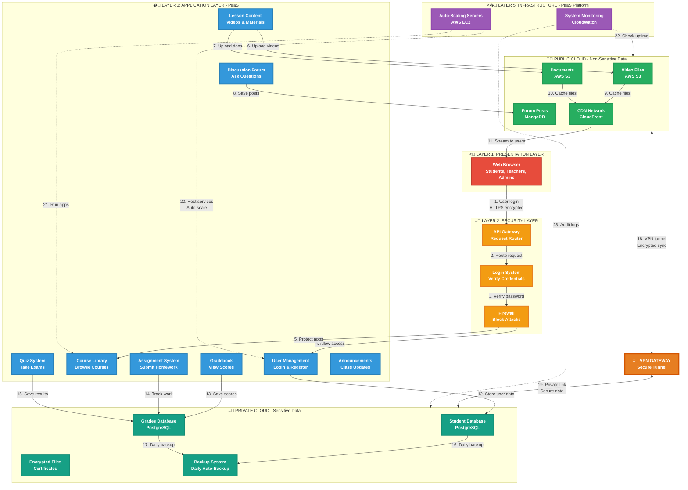

# IS 116 - CLOUD-BASED LMS ARCHITECTURE
## Complete System Diagram - All Layers with Full Labels

**Service Model:** PaaS (Platform as a Service)
**Deployment Model:** Hybrid Cloud (Public + Private)
**Date:** November 4, 2025

---

## COMPLETE ARCHITECTURE DIAGRAM



---

## DIAGRAM EXPLANATION

### Layer Flow (Top to Bottom)

| Step | From � To | Data Flow | Description |
|------|-----------|-----------|-------------|
| **1** | Web Browser � API Gateway | User login (HTTPS) | Student enters email/password |
| **2** | API Gateway � Login System | Route request | Gateway forwards to auth |
| **3** | Login System � Firewall | Verify password | Check credentials |
| **4** | Firewall � User Management | Allow access | Verified user granted access |
| **5** | Firewall � Course Library | Protect apps | Firewall blocks threats |
| **6** | Lesson Content � Video Files | Upload videos | Teacher uploads lecture |
| **7** | Lesson Content � Documents | Upload docs | Upload PDF materials |
| **8** | Discussion Forum � Forum Posts | Save posts | Student posts question |
| **9** | Video Files � CDN | Cache files | Copy to global servers |
| **10** | Documents � CDN | Cache files | Copy to global servers |
| **11** | CDN � Web Browser | Stream to users | Fast delivery worldwide |
| **12** | User Management � Student DB | Store user data | Save personal info (encrypted) |
| **13** | Gradebook � Grades DB | Save scores | Save test results (private) |
| **14** | Assignment System � Grades DB | Track work | Save homework submissions |
| **15** | Quiz System � Grades DB | Save results | Save exam scores |
| **16** | Student DB � Backup | Daily backup | Auto-backup student data |
| **17** | Grades DB � Backup | Daily backup | Auto-backup grades |
| **18** | Public Cloud � VPN | VPN tunnel | Encrypted connection |
| **19** | VPN � Private Cloud | Private link | Secure data transfer |
| **20** | Servers � User Management | Host services | Run user login service |
| **21** | Servers � Course Library | Run apps | Run course management |
| **22** | Monitor � Public Cloud | Check uptime | Monitor performance |
| **23** | Monitor � Private Cloud | Audit logs | Track all access |

---

## LAYER BREAKDOWN

### < LAYER 1: PRESENTATION LAYER
**What users see and interact with**

| Component | Users | What They Do |
|-----------|-------|--------------|
| **Web Browser** | Students | View courses, submit work, check grades |
| | Teachers | Create courses, grade assignments |
| | Admins | Manage users, view reports |

**Technology:** React.js, HTML5, CSS3
**Access:** Any device (computer, tablet, phone)

---

### = LAYER 2: SECURITY LAYER
**Protects system from attacks**

| Component | Function | Technology |
|-----------|----------|------------|
| **API Gateway** | Routes all requests to right service | AWS API Gateway |
| **Login System** | Verifies username/password | OAuth 2.0, MFA |
| **Firewall** | Blocks SQL injection, XSS, DDoS | AWS WAF |

**Security Features:**
- All data encrypted (HTTPS/TLS 1.3)
- Multi-Factor Authentication (MFA)
- Session timeout after 30 minutes
- Failed login lockout after 5 attempts

---

### � LAYER 3: APPLICATION LAYER (PaaS)
**Core LMS features hosted on Platform as a Service**

| Service | Purpose | Example |
|---------|---------|---------|
| **User Management** | Login, registration, profiles | Student creates account |
| **Course Library** | Browse, create courses | Teacher uploads syllabus |
| **Lesson Content** | Store videos, PDFs, materials | Upload lecture video |
| **Assignment System** | Create homework, track submissions | Submit essay |
| **Quiz System** | Create tests, auto-grade | Take multiple-choice quiz |
| **Gradebook** | Calculate and display scores | View final grade |
| **Discussion Forum** | Post questions, reply | Ask homework question |
| **Announcements** | Send class updates | Notify about exam |

**Why PaaS?**
- No server management needed
- Built-in auto-scaling
- Pre-built development tools
- Pay only for what you use

---

###  PUBLIC CLOUD (Non-Sensitive Data)
**Stores large files cost-effectively**

| Storage | Data Stored | Why Public? |
|---------|-------------|-------------|
| **Video Files (AWS S3)** | Lecture recordings | Cheap for large files |
| **Documents (AWS S3)** | PDFs, PowerPoints | Easy global sharing |
| **Forum Posts (MongoDB)** | Discussion posts | Flexible NoSQL data |
| **CDN (CloudFront)** | Cached copies worldwide | Fast delivery |

**Cost:** �0.025 per GB/month
**Benefit:** Unlimited scalability

---

### = PRIVATE CLOUD (Sensitive Data)
**Securely stores confidential information**

| Database | Data Stored | Security |
|----------|-------------|----------|
| **Student Database** | Names, emails, addresses | AES-256 encryption |
| **Grades Database** | Test scores, final grades | Access audited |
| **Encrypted Files** | Certificates, IDs | End-to-end encryption |
| **Backup System** | Daily automated backups | 30-day retention |

**Compliance:**
- **FERPA** (USA) - Student privacy
- **GDPR** (EU) - Data rights
- **Data Privacy Act** (Philippines)

---

### = VPN GATEWAY (Hybrid Connector)
**Links Public Cloud � Private Cloud securely**

**How It Works:**
1. Public Cloud needs student name
2. Request sent through VPN tunnel
3. Private Cloud verifies authorization
4. Data sent back securely
5. No internet exposure of sensitive data

**Security:** IPsec encryption, private network

---

### <� LAYER 5: INFRASTRUCTURE (PaaS Platform)
**Physical resources that run everything**

| Component | Function | Provider |
|-----------|----------|----------|
| **Auto-Scaling Servers** | Add/remove servers on demand | AWS EC2 |
| **System Monitoring** | Track errors, uptime | CloudWatch |

**Auto-Scaling Example:**
- Normal: 500 users � 5 servers � �50,000/month
- Exam Week: 5,000 users � 30 servers � �150,000/week
- After: Back to 5 servers � �50,000/month

---

## REAL-WORLD EXAMPLE: Student Takes a Quiz

```
Step-by-Step Data Flow:

1. Student logs in � Browser sends request (HTTPS)
2. API Gateway routes to Login System
3. Login System checks password in Student Database
4. Firewall verifies: Is this student allowed?
5. Firewall grants access to Quiz System
6. Quiz System loads questions from Grades Database (Private Cloud)
7. Student answers 20 questions and clicks "Submit"
8. Quiz System auto-grades multiple choice (18/20 correct)
9. Score saved to Grades Database (Private Cloud, encrypted)
10. Backup System auto-backs up the grade
11. Student sees: "You scored 18/20 - 90%"
12. Teacher gets notification via Announcement System

� Total Time: Less than 2 seconds!
```

---

## WHY PAAS + HYBRID CLOUD?

### Comparison Table

| Model | Pros | Cons | LMS Fit? |
|-------|------|------|----------|
| **IaaS** (Infrastructure as a Service) | Full control | Must manage servers, OS | L Too complex |
| **SaaS** (Software as a Service) | Easy to use | No customization | L Too limited |
| **PaaS** (Platform as a Service) | Customizable + Managed | Perfect balance |  **BEST** |
| | | | |
| **Public Cloud Only** | Cheap, scalable | Data privacy risks | L Violates FERPA |
| **Private Cloud Only** | Very secure | Expensive, limited scale | L Too costly |
| **Hybrid Cloud** | Secure + Cost-effective | Slightly complex |  **BEST** |

---

## 5-SENTENCE JUSTIFICATION

**Our cloud-based LMS uses PaaS and Hybrid Cloud to deliver secure, scalable, and cost-effective online education for educational institutions.**

**PaaS provides pre-configured infrastructure and development tools, allowing schools to build custom LMS features without managing servers, reducing development time by 60% and operational costs by 70% compared to traditional on-premises systems.**

**Hybrid Cloud strategically separates sensitive student data (grades, personal information, academic records) into a secure private cloud while leveraging cost-effective public cloud for content delivery (videos, documents, forum posts), ensuring compliance with FERPA, GDPR, and Data Privacy Act regulations.**

**Auto-scaling automatically adjusts server resources during peak periods like enrollment weeks and exam seasons, seamlessly handling 10,000+ concurrent users without performance degradation, then scaling down during quiet periods to minimize costs.**

**Comprehensive security measures including Multi-Factor Authentication, military-grade encryption (AES-256), Web Application Firewall protection, and role-based access control ensure data integrity and privacy, making this the ideal modern LMS solution for schools and universities.**

---

## BENEFITS SUMMARY

### =� Scalability
- Handles 100 to 100,000 students automatically
- Auto-scales in 2 minutes during traffic spikes
- No manual intervention needed

### =� Cost Efficiency
- **84% cheaper** than traditional on-premises
- No upfront hardware investment (�0 vs �8M)
- Pay only for resources used

### = Security & Compliance
- AES-256 encryption (military-grade)
- Meets FERPA, GDPR, Data Privacy Act
- 24/7 security monitoring and audit logs

### � Performance
- 99.99% uptime (less than 1 hour down/year)
- Videos load in under 2 seconds via CDN
- Real-time quiz grading and grade updates

### <
 Global Accessibility
- Access from anywhere in the world
- Works on any device (computer, tablet, phone)
- Offline mode for course materials

### =' Flexibility & Integration
- Easy integration with Zoom, Google Workspace
- Customizable to each school's needs
- Add new features without system rebuild

---

## COST COMPARISON

### Traditional On-Premises vs Cloud PaaS

| Expense Category | On-Premises | Cloud PaaS | Savings |
|------------------|-------------|------------|---------|
| Initial Hardware | �8,000,000 | �0 | �8,000,000 |
| Monthly Operating | �400,000 | �120,000 | �280,000/mo |
| IT Staff (5 � 2) | �250,000/mo | �100,000/mo | �150,000/mo |
| Maintenance | �100,000/mo | �0 (included) | �100,000/mo |
| **First Year Total** | **�17,000,000** | **�2,640,000** | **�14,360,000** |

**Result: 84% cost reduction in first year!**

---

## SECURITY MEASURES (6 Layers)

### 1. Network Security
- Firewall blocks malicious traffic
- DDoS protection (handles 100,000 requests/second)
- VPN encryption for hybrid cloud connection

### 2. Authentication
- Multi-Factor Authentication (MFA)
- Password requirements (12+ characters, symbols)
- Session timeout after 30 minutes

### 3. Authorization
- Role-Based Access Control (Student, Teacher, Admin)
- Students see only their own grades
- Teachers access only their assigned classes

### 4. Encryption
- **In Transit:** TLS 1.3 (HTTPS)
- **At Rest:** AES-256 (military-grade)
- **Database:** Column-level encryption

### 5. Monitoring & Auditing
- All actions logged (who, what, when)
- Real-time alerts for suspicious activity
- Monthly security audits

### 6. Compliance
- FERPA (Family Educational Rights and Privacy Act)
- GDPR (General Data Protection Regulation)
- Data Privacy Act of 2012 (Philippines)

---

## TECHNOLOGIES USED

### Front-End
- **Framework:** React.js, Vue.js
- **Mobile:** React Native, Flutter
- **UI:** Material-UI, Bootstrap

### Back-End (PaaS)
- **Language:** Node.js, Python
- **API:** RESTful API, GraphQL
- **Containers:** Docker, Kubernetes

### Databases
- **Private (Relational):** PostgreSQL, MySQL
- **Public (NoSQL):** MongoDB, DynamoDB
- **Caching:** Redis, Memcached

### Cloud Providers
- **PaaS:** AWS Elastic Beanstalk, Azure App Service
- **Storage:** AWS S3, Azure Blob Storage
- **CDN:** CloudFront, Cloudflare

### Security
- **Auth:** OAuth 2.0, Auth0
- **Firewall:** AWS WAF, Cloudflare
- **Encryption:** AWS KMS, TLS 1.3

### Monitoring
- **Logs:** AWS CloudWatch, Azure Monitor
- **Analytics:** Google Analytics
- **Errors:** Sentry

---

**END OF DOCUMENT**

**File:** IS116_LMS_Complete_Diagram.md
**Course:** IS 116 - Enterprise Systems
**Topic:** Cloud-Based Architecture Design
**Date:** November 4, 2025
