# IS 116 - ENTERPRISE SYSTEMS
## Cloud-Based Architecture Design Activity
### Learning Management System (LMS)

**Group Assignment**
**Date:** November 4, 2025

---

## BUSINESS CASE: LEARNING MANAGEMENT SYSTEM (LMS)

### System Overview
A cloud-based Learning Management System (LMS) that enables educational institutions to deliver online courses, manage student enrollments, track academic progress, facilitate virtual classrooms, and provide collaborative learning tools for students and instructors.

### Target Users
- **Students** - Access courses, submit assignments, take exams, view grades
- **Teachers/Instructors** - Create courses, upload materials, grade assignments, conduct online classes
- **Administrators** - Manage users, monitor system usage, generate reports
- **Parents** - Monitor student progress and performance

---

## 1. CHOSEN SERVICE MODEL: PaaS (Platform as a Service)

### Service Model: **PaaS (Platform as a Service)**

### Why PaaS?

**Definition:** PaaS provides a complete development and deployment environment in the cloud, with resources that enable institutions to deliver everything from simple cloud-based apps to sophisticated, cloud-enabled enterprise applications.

**Key Features:**
- Pre-configured infrastructure (servers, storage, networking)
- Development tools and frameworks
- Database management systems
- Middleware and runtime environments
- Built-in scalability and load balancing

### PaaS Components for LMS:
1. **Development Platform** - Build custom LMS features
2. **Database Services** - PostgreSQL, MySQL for user and course data
3. **File Storage** - Cloud storage for course materials, videos, documents
4. **API Services** - Integration with third-party tools (Zoom, Google Workspace)
5. **Analytics Services** - Track student performance and engagement

### Why PaaS over IaaS or SaaS?

| Aspect | Why PaaS is Better for LMS |
|--------|---------------------------|
| **Customization** | Allows educational institutions to customize features specific to their curriculum and teaching methods |
| **Development Speed** | Pre-built components accelerate development of custom LMS features |
| **Cost Efficiency** | No need to manage servers, OS, or middleware - focus on application development |
| **Scalability** | Automatic scaling during peak periods (enrollment, exam seasons) |
| **Integration** | Easy integration with existing school systems (student information systems, payment gateways) |

---

## 2. CHOSEN DEPLOYMENT MODEL: Hybrid Cloud

### Deployment Model: **Hybrid Cloud**

### Why Hybrid Cloud?

**Definition:** Hybrid cloud combines public cloud and private cloud environments, allowing data and applications to be shared between them, providing greater flexibility and optimization of existing infrastructure.

### Hybrid Cloud Structure for LMS:

#### **Public Cloud Components:**
- Course content delivery (videos, documents, readings)
- Discussion forums and collaboration tools
- General announcements and notifications
- Non-sensitive student activities and assignments
- Video streaming for recorded lectures

**Provider:** AWS, Google Cloud, or Microsoft Azure

**Benefits:**
- Cost-effective for high-volume, non-sensitive data
- Global content delivery network (CDN) for fast access
- Scalable bandwidth for video streaming
- Pay-as-you-go pricing model

#### **Private Cloud Components:**
- Student personal information (addresses, contact details, IDs)
- Academic records and transcripts
- Grades and assessment results
- Financial records (tuition payments, scholarships)
- Faculty and staff sensitive data

**Deployment:** On-premises data center or dedicated private cloud service

**Benefits:**
- Enhanced security and data privacy
- Compliance with educational data protection regulations
- Full control over sensitive data
- Reduced risk of data breaches

### Why Hybrid Cloud over Public or Private Only?

| Model | Limitation | How Hybrid Solves It |
|-------|-----------|---------------------|
| **Public Cloud Only** | Data privacy concerns for student records | Private cloud handles sensitive data |
| **Private Cloud Only** | High infrastructure costs, limited scalability | Public cloud provides cost-effective scaling |
| **Hybrid** | **Best of both worlds** | Balance security, cost, and performance |

---

## 3. CLOUD-BASED LMS ARCHITECTURE DIAGRAM

### Complete 5-Layer Architecture with Labeled Connections

```mermaid
graph TB
    subgraph LAYER1["🌐 LAYER 1: PRESENTATION LAYER"]
        BROWSER["Web Browser<br/>Chrome, Firefox, Safari"]
        STUDENT["Student Dashboard<br/>View Courses, Grades"]
        TEACHER["Teacher Dashboard<br/>Manage Classes"]
        ADMIN["Admin Dashboard<br/>System Management"]
    end

    subgraph LAYER2["🔐 LAYER 2: SECURITY LAYER"]
        GATEWAY["API Gateway<br/>Request Router"]
        LOGIN["Login System<br/>Username/Password"]
        FIREWALL["Firewall<br/>Security Protection"]
    end

    subgraph LAYER3["⚙️ LAYER 3: APPLICATION LAYER - PaaS"]
        direction LR

        subgraph CORE["Core Systems"]
            USERS["User Accounts<br/>Registration/Login"]
            COURSES["Course Library<br/>Create/Browse Courses"]
        end

        subgraph LEARNING["Learning Tools"]
            LESSONS["Lesson Content<br/>Materials & Videos"]
            HOMEWORK["Assignments<br/>Submit Work"]
            TESTS["Quizzes/Exams<br/>Take Tests"]
            GRADES["Gradebook<br/>View Scores"]
        end

        subgraph SOCIAL["Collaboration"]
            FORUM["Discussion Board<br/>Ask Questions"]
            MESSAGES["Announcements<br/>Class Updates"]
        end
    end

    subgraph LAYER4["💾 LAYER 4: DATA STORAGE - HYBRID CLOUD"]
        direction LR

        subgraph PUBLIC["☁️ PUBLIC CLOUD<br/>Non-Sensitive Data"]
            VIDEOS["Video Storage<br/>Lecture Videos"]
            DOCS["Document Storage<br/>PDFs, PowerPoints"]
            FORUMDATA["Forum Posts<br/>Discussions"]
            FASTCDN["CDN Network<br/>Fast Downloads"]
        end

        subgraph PRIVATE["🔒 PRIVATE CLOUD<br/>Sensitive Data"]
            USERDB["Student Database<br/>Names, Emails"]
            GRADEDB["Grade Records<br/>Test Scores"]
            PERSONAL["Personal Files<br/>IDs, Certificates"]
            BACKUPS["Daily Backups<br/>Data Safety"]
        end

        VPNLINK["🔐 VPN Connection<br/>Secure Link"]
    end

    subgraph LAYER5["🏗️ LAYER 5: INFRASTRUCTURE - PaaS Platform"]
        SERVERS["Cloud Servers<br/>AWS/Azure/GCP"]
        WATCH["System Monitor<br/>Check Performance"]
    end

    %% LAYER 1 → LAYER 2
    BROWSER -->|"HTTPS"| GATEWAY
    STUDENT -->|"Access"| GATEWAY
    TEACHER -->|"Manage"| GATEWAY
    ADMIN -->|"Admin"| GATEWAY

    %% LAYER 2 → LAYER 3
    GATEWAY -->|"Route"| LOGIN
    LOGIN -->|"Verify"| FIREWALL
    FIREWALL -->|"Protect"| USERS
    FIREWALL -->|"Allow"| COURSES

    %% LAYER 3 → LAYER 4 PUBLIC CLOUD
    LESSONS -->|"Upload videos"| VIDEOS
    LESSONS -->|"Upload docs"| DOCS
    FORUM -->|"Save posts"| FORUMDATA
    VIDEOS -->|"Cache files"| FASTCDN
    DOCS -->|"Cache files"| FASTCDN

    %% LAYER 3 → LAYER 4 PRIVATE CLOUD
    USERS -->|"Store data"| USERDB
    GRADES -->|"Save grades"| GRADEDB
    HOMEWORK -->|"Track work"| GRADEDB
    TESTS -->|"Save scores"| GRADEDB
    USERDB -->|"Daily backup"| BACKUPS
    GRADEDB -->|"Daily backup"| BACKUPS

    %% HYBRID CLOUD CONNECTION
    PUBLIC <-->|"VPN tunnel"| VPNLINK
    VPNLINK <-->|"Secure link"| PRIVATE

    %% LAYER 5 INFRASTRUCTURE
    SERVERS -.->|"Host apps"| USERS
    SERVERS -.->|"Auto-scale"| COURSES
    WATCH -.->|"Monitor"| PUBLIC
    WATCH -.->|"Monitor"| PRIVATE

    classDef style1 fill:#e74c3c,stroke:#c0392b,stroke-width:2px,color:#fff
    classDef style2 fill:#f39c12,stroke:#e67e22,stroke-width:2px,color:#fff
    classDef style3 fill:#3498db,stroke:#2980b9,stroke-width:2px,color:#fff
    classDef style4pub fill:#27ae60,stroke:#229954,stroke-width:2px,color:#fff
    classDef style4priv fill:#16a085,stroke:#138d75,stroke-width:2px,color:#fff
    classDef style5 fill:#9b59b6,stroke:#8e44ad,stroke-width:2px,color:#fff

    class BROWSER,STUDENT,TEACHER,ADMIN style1
    class GATEWAY,LOGIN,FIREWALL style2
    class USERS,COURSES,LESSONS,HOMEWORK,TESTS,GRADES,FORUM,MESSAGES style3
    class VIDEOS,DOCS,FORUMDATA,FASTCDN style4pub
    class USERDB,GRADEDB,PERSONAL,BACKUPS,VPNLINK style4priv
    class SERVERS,WATCH style5
```



---

### How Each Layer Works

---

#### 🌐 LAYER 1: PRESENTATION (What Users See)

**Web Browser Access:**
- Students, teachers, and admins access the LMS through any web browser
- No need to install apps - just go to the website
- Works on computers, tablets, phones

**What Each User Sees:**

| User Type | What They Can Do |
|-----------|------------------|
| **👨‍🎓 Student** | • Browse enrolled courses<br/>• Watch video lectures<br/>• Submit assignments<br/>• Take quizzes<br/>• Check grades<br/>• Post in discussion boards |
| **👨‍🏫 Teacher** | • Create new courses<br/>• Upload videos and PDFs<br/>• Create assignments and quizzes<br/>• Grade student work<br/>• View class performance<br/>• Send announcements |
| **👨‍💼 Admin** | • Add/remove users<br/>• Assign roles (student, teacher)<br/>• View system reports<br/>• Configure settings<br/>• Monitor usage |

---

#### 🔐 LAYER 2: SECURITY (Keeps Everything Safe)

**How Login Works:**
1. User enters email and password
2. System checks if credentials are correct
3. Can also login with Google or Microsoft account (SSO)
4. System creates a secure session

**Security Features:**
- **API Gateway:** Directs requests to the right place, like a traffic cop
- **Login System:** Verifies who you are before letting you in
- **Firewall:** Blocks hackers and malicious attacks
- All data sent over the internet is encrypted (HTTPS)

---

#### ⚙️ LAYER 3: APPLICATION (The Brain of the LMS)

**This is where the magic happens - hosted on PaaS (Platform as a Service)**

**Core Features:**
- **Login & Accounts:** Manages user accounts, passwords, profiles
- **Course Builder:** Teachers create courses, organize modules and lessons
- **Content Manager:** Stores and organizes all course materials

**Learning Features:**
- **Assignments:** Create, submit, and track assignments with deadlines
- **Quizzes & Tests:** Multiple choice, true/false, essays with auto-grading
- **Gradebook:** Calculates and displays grades automatically

**Collaboration:**
- **Discussion Boards:** Students and teachers can post questions and replies
- **Video Lectures:** Upload and stream educational videos
- **Notifications:** Email and in-app alerts for deadlines, grades, announcements

**Cache (Fast Access):**
- Stores frequently-used data in memory for instant loading
- Makes the site load 5-10x faster

---

#### 💾 LAYER 4: DATA STORAGE (Hybrid Cloud - Two Types)

**☁️ PUBLIC CLOUD (For Regular Files):**

Stores non-sensitive content that can be shared publicly:
- **📁 File Storage:** Course videos, PDF handouts, PowerPoint slides, images
- **📝 Discussion Posts:** Forum messages, comments, announcements
- **🌍 CDN (Content Delivery Network):** Copies files to servers around the world so videos load fast for everyone

**Why Public Cloud?**
- Cheap to store large video files
- Fast delivery anywhere in the world
- Easily scalable (can add unlimited storage)

---

**🔒 PRIVATE CLOUD (For Sensitive Data):**

Stores confidential information that must be protected:
- **🗄️ Database:** Student names, email addresses, phone numbers, grades, academic records
- **🔐 Encrypted Files:** Official transcripts, certificates, government IDs
- **💾 Backups:** Daily automatic backups in case of data loss

**Why Private Cloud?**
- Full control over sensitive student data
- Meets FERPA regulations (student privacy law)
- Extra security measures (encryption, access controls)

---

**🔐 VPN Tunnel (Hybrid Link):**
- Securely connects Public Cloud ↔ Private Cloud
- Encrypted connection so data can't be intercepted
- Allows the system to use both clouds seamlessly

---

#### 🏗️ LAYER 5: INFRASTRUCTURE (The Foundation)

**Servers (Auto-Scaling):**
- Computers that run all the LMS features
- Automatically adds more servers when many students are online (e.g., exam day)
- Removes extra servers when traffic is low to save money

**Monitoring & Logs:**
- Constantly checks if everything is working properly
- Records all actions (who logged in, what was accessed)
- Sends alerts if something breaks

---

### Real-World Example: Student Taking a Quiz

```
1. Student logs in to LMS website
   ↓
2. Clicks on "Quiz 1" in their course
   ↓
3. Login system verifies student is enrolled in the course
   ↓
4. Quiz questions loaded from Database (Private Cloud)
   ↓
5. Student answers questions and clicks "Submit"
   ↓
6. System auto-grades multiple choice questions
   ↓
7. Saves answers and grade to Database (Private Cloud)
   ↓
8. Student sees their score: "You got 18/20 - 90%"
   ↓
9. Teacher receives notification: "John Doe completed Quiz 1"
```

---

### Why Hybrid Cloud is Perfect for LMS

| Aspect | Benefit |
|--------|---------|
| **Scalability** | Can handle 100 students or 100,000 students - system grows automatically |
| **Cost** | Only pay for what you use. No expensive servers sitting idle |
| **Speed** | Videos delivered from CDN - fast loading anywhere in the world |
| **Security** | Student grades protected in Private Cloud - meets FERPA requirements |
| **Reliability** | 99.9% uptime - LMS available 24/7, even during exams |
| **Flexibility** | Add new features easily - teachers can request new tools |

---

### Key Technologies Used

| Component | Technology | Purpose |
|-----------|-----------|---------|
| **Front-end** | React.js, HTML5, CSS3 | What users see in browser |
| **Back-end** | Node.js, Python | Business logic that runs behind the scenes |
| **Public Storage** | AWS S3, Azure Blob | Store videos, PDFs cheaply |
| **Private Database** | PostgreSQL, MySQL | Store grades, student info securely |
| **CDN** | CloudFront, Cloudflare | Fast global content delivery |
| **Cache** | Redis | Super-fast temporary data storage |
| **Servers** | AWS EC2, Azure VMs | Computers that run the application |

---

## 4. KEY COMPONENTS BREAKDOWN

### 4.1 CLIENT LAYER (Front-End)

**Technologies:**
- **Web Application:** React.js / Vue.js / Angular
- **Mobile Apps:** React Native / Flutter (iOS & Android)
- **Progressive Web App (PWA)** for offline access

**Features:**
- Responsive design for all devices
- Offline course content access
- Push notifications for assignments and announcements
- Video player with playback controls

**User Interfaces:**
- **Student Dashboard:** Enrolled courses, upcoming assignments, grades
- **Teacher Dashboard:** Course management, grading tools, analytics
- **Admin Dashboard:** User management, system reports, configurations

---

### 4.2 SECURITY & AUTHENTICATION LAYER

#### API Gateway & Load Balancer
- **Function:** Routes requests, distributes traffic across multiple servers
- **Features:** Rate limiting, DDoS protection, SSL/TLS termination
- **Tools:** AWS API Gateway, Azure API Management, Kong

#### Authentication & Authorization
- **OAuth 2.0 / OpenID Connect:** Single Sign-On (SSO) with Google, Microsoft, Facebook
- **Multi-Factor Authentication (MFA):** SMS, Email, Authenticator apps
- **Role-Based Access Control (RBAC):** Different permissions for Students, Teachers, Admins

#### Web Application Firewall (WAF)
- **Protection Against:**
  - SQL Injection
  - Cross-Site Scripting (XSS)
  - Cross-Site Request Forgery (CSRF)
  - Distributed Denial of Service (DDoS)

---

### 4.3 APPLICATION LAYER (Business Logic)

**Microservices Architecture:**

1. **Course Management Service**
   - Create, edit, delete courses
   - Upload course materials
   - Manage course modules and lessons

2. **User Management Service**
   - User registration and profiles
   - Role assignments
   - Profile updates

3. **Assignment Management Service**
   - Create assignments with deadlines
   - File uploads (documents, images)
   - Submission tracking

4. **Grading Service**
   - Manual and automated grading
   - Rubric-based grading
   - Grade calculations and reports

5. **Video Streaming Service**
   - Live streaming for virtual classes
   - Recorded lecture playback
   - Video quality adjustment

6. **Discussion Forum Service**
   - Create discussion threads
   - Post comments and replies
   - Moderation tools

7. **Quiz & Exam Service**
   - Multiple choice, essay, true/false questions
   - Timed exams
   - Automatic grading for objective questions

8. **Analytics & Reports Service**
   - Student performance analytics
   - Course engagement metrics
   - Institutional reports

9. **Notification Service**
   - Email notifications
   - SMS alerts
   - Push notifications

10. **Integration Service**
    - Zoom/Google Meet integration
    - Google Workspace/Microsoft Office 365
    - Payment gateway integration

11. **Calendar Service**
    - Class schedules
    - Assignment deadlines
    - Event reminders

12. **Payment Gateway Service**
    - Course enrollment fees
    - Tuition payments
    - Secure payment processing

**Message Queue / Event Bus:**
- **Tools:** RabbitMQ, Apache Kafka, AWS SQS
- **Purpose:** Asynchronous processing, service-to-service communication

**Caching Layer:**
- **Tools:** Redis, Memcached
- **Purpose:** Session management, frequently accessed data, performance boost

---

### 4.4 DATA LAYER (Storage)

#### PUBLIC CLOUD STORAGE (Non-Sensitive Data)

**Cloud Object Storage:**
- **Services:** AWS S3, Azure Blob Storage, Google Cloud Storage
- **Stored Data:**
  - Course videos and lecture recordings
  - PDF documents, presentations, images
  - Assignment files (submitted by students)
  - Public course materials

**NoSQL Database:**
- **Services:** MongoDB, AWS DynamoDB, Azure Cosmos DB
- **Stored Data:**
  - Discussion forum posts and comments
  - Course activity logs
  - Announcement history
  - User sessions

**Content Delivery Network (CDN):**
- **Services:** CloudFlare, AWS CloudFront, Azure CDN
- **Purpose:**
  - Fast global content delivery
  - Video streaming optimization
  - Reduced latency for international students

#### PRIVATE CLOUD STORAGE (Sensitive Data)

**Private Database Server:**
- **Technologies:** PostgreSQL, MySQL (on-premises or dedicated cloud)
- **Stored Data:**
  - User personal information (names, addresses, IDs)
  - Academic records and transcripts
  - Grades and assessment results
  - Financial records and payment history
  - Faculty and staff sensitive data

**Encrypted File Storage:**
- **Encryption:** AES-256
- **Stored Data:**
  - Signed enrollment contracts
  - Official certificates and diplomas
  - Scanned government IDs
  - Medical records (if required)

**Backup & Disaster Recovery:**
- Automated daily backups
- Point-in-time recovery
- Geographic redundancy (multi-location backups)
- 30-day backup retention

#### Data Encryption
- **At Rest:** AES-256 encryption
- **In Transit:** TLS 1.3 (HTTPS)
- **Key Management:** AWS KMS, Azure Key Vault

---

### 4.5 INFRASTRUCTURE LAYER (PaaS Provider)

#### Compute Resources
- **Auto-Scaling VM Instances:** AWS EC2, Azure Virtual Machines
- **Container Orchestration:** Kubernetes, Docker Swarm
- **Serverless Functions:** AWS Lambda, Azure Functions (for event-driven tasks)

#### Networking & Connectivity
- **Virtual Private Cloud (VPC):** Isolated network environment
- **VPN Gateway:** Secure tunnel between public and private cloud
- **Direct Connect:** Dedicated high-speed connection

#### Monitoring & Logging
- **Tools:** AWS CloudWatch, Azure Monitor, Google Cloud Logging
- **Features:**
  - Application performance monitoring
  - Error tracking and alerting
  - User activity logs
  - Security audit trails

#### Backup & Disaster Recovery
- Automated backups
- Multi-region replication
- 99.99% uptime SLA
- Disaster recovery plan with failover

---

## 5. SECURITY MEASURES

### 5.1 Authentication Security
- Multi-Factor Authentication (MFA)
- Password complexity requirements
- Session timeout (auto-logout after inactivity)
- Account lockout after failed login attempts

### 5.2 Data Security
- End-to-end encryption (TLS 1.3)
- Data encryption at rest (AES-256)
- Secure key management
- Regular security audits

### 5.3 Network Security
- Web Application Firewall (WAF)
- DDoS protection
- Intrusion Detection System (IDS)
- Virtual Private Cloud (VPC) isolation

### 5.4 Access Control
- Role-Based Access Control (RBAC)
- Principle of least privilege
- Audit logging of all access attempts
- Regular access reviews

### 5.5 Compliance
- **FERPA (Family Educational Rights and Privacy Act)** - U.S. student data protection
- **GDPR (General Data Protection Regulation)** - EU data privacy
- **Data Privacy Act of 2012 (Philippines)** - Philippine data protection law
- **ISO 27001** - Information security management

### 5.6 Data Privacy
- Student data anonymization for analytics
- Consent management for data collection
- Right to data deletion (GDPR compliance)
- Transparent privacy policy

---

## 6. FIVE-SENTENCE JUSTIFICATION

**Our cloud-based LMS architecture uses PaaS (Platform as a Service) and Hybrid Cloud deployment to deliver a secure, scalable, and cost-effective learning platform.**

**PaaS was chosen because it provides pre-configured infrastructure and development tools, allowing educational institutions to focus on building custom features specific to their curriculum without managing servers or middleware, significantly reducing development time and operational costs.**

**The Hybrid Cloud model strategically separates sensitive student data (grades, personal information, financial records) into a secure private cloud while leveraging public cloud for non-sensitive content delivery (videos, course materials, forums), ensuring compliance with educational data protection regulations like FERPA and Data Privacy Act while maintaining cost efficiency.**

**This architecture supports unlimited scalability during peak periods such as enrollment seasons and exam weeks, automatically adjusting resources to handle thousands of concurrent users without performance degradation, while the microservices architecture enables independent scaling of high-demand services like video streaming and assignment submissions.**

**The comprehensive security measures including Multi-Factor Authentication, role-based access control, end-to-end encryption, and Web Application Firewall protection ensure data integrity and privacy, making this solution ideal for educational institutions seeking a modern, secure, and flexible learning management system.**

---

## 7. BENEFITS ANALYSIS

### 7.1 Scalability Benefits

**Automatic Scaling:**
- System automatically adds resources during peak usage
- No manual intervention required
- Scales down during low-usage periods to save costs

**Scenarios:**
- **Enrollment Period:** Handles 10,000+ simultaneous course registrations
- **Exam Week:** Supports thousands of students taking online exams concurrently
- **Video Lectures:** Streams high-quality videos to unlimited concurrent viewers

**PaaS Advantage:** Built-in load balancing and auto-scaling without infrastructure management

---

### 7.2 Cost Benefits

**Cost Savings:**
- **No Hardware Investment:** Eliminates upfront costs for servers, storage, networking equipment
- **Pay-As-You-Go:** Only pay for resources used
- **Reduced IT Staff:** No need for infrastructure management team
- **Automatic Updates:** PaaS provider handles system updates and patches

**Cost Comparison:**

| Item | Traditional On-Premises | Cloud-Based PaaS |
|------|------------------------|------------------|
| **Initial Setup** | ₱5,000,000 - ₱10,000,000 | ₱50,000 - ₱100,000 |
| **Monthly Operating Cost** | ₱200,000 - ₱500,000 | ₱50,000 - ₱150,000 |
| **IT Staff (5 people)** | ₱250,000/month | ₱100,000/month (2 people) |
| **Maintenance & Upgrades** | ₱100,000/month | Included in PaaS |
| **Total First Year** | ₱9,200,000+ | ₱2,000,000 - ₱3,000,000 |

**Hybrid Cloud Cost Optimization:**
- Store high-volume media files in cheap public cloud storage
- Keep only sensitive data in more expensive private cloud
- Use CDN to reduce bandwidth costs

---

### 7.3 Security Benefits

**Enhanced Protection:**
- **Multiple Layers of Security:** Firewall, encryption, authentication, authorization
- **Compliance:** Meets FERPA, GDPR, Data Privacy Act requirements
- **Regular Security Updates:** PaaS provider handles security patches
- **Disaster Recovery:** Automated backups and failover systems

**Hybrid Cloud Security Advantage:**
- Sensitive data isolated in private cloud
- Public cloud for non-sensitive, high-volume content
- Full control over student privacy and academic records

**Security Features:**
- 99.99% uptime SLA
- DDoS protection
- Intrusion detection
- Security monitoring 24/7

---

### 7.4 Performance Benefits

**High Performance:**
- **CDN:** Fast content delivery globally (videos load 3-5x faster)
- **Caching:** Frequently accessed data served instantly
- **Low Latency:** Students experience minimal delays
- **High Availability:** 99.99% uptime guarantee

**User Experience:**
- Video lectures stream smoothly without buffering
- Assignment submissions upload quickly
- Real-time collaboration in discussion forums
- Instant grade updates

---

### 7.5 Flexibility & Integration Benefits

**Easy Integration:**
- Zoom/Google Meet for video conferencing
- Google Workspace/Microsoft Office 365 for document collaboration
- Payment gateways (PayPal, Stripe, PayMongo)
- Third-party educational tools (Turnitin for plagiarism detection)

**Customization:**
- PaaS allows custom feature development
- Institutions can brand the LMS with their colors, logos
- Add specialized tools for specific courses (science labs, coding environments)

**Multi-Device Access:**
- Works on web browsers, mobile apps, tablets
- Offline mode for course materials
- Sync across devices

---

## 8. PRESENTATION TALKING POINTS (5-10 Minutes)

### Opening (1 minute)
"Good [morning/afternoon], our group designed a cloud-based architecture for a **Learning Management System (LMS)** that enables educational institutions to deliver online education securely, cost-effectively, and at scale."

---

### Slide 1: Service Model - PaaS (1.5 minutes)

**What to say:**
"We chose **PaaS (Platform as a Service)** as our service model because it provides the perfect balance between customization and operational simplicity.

With PaaS, educational institutions get:
- Pre-configured infrastructure (no server management)
- Development tools to build custom features
- Built-in scalability for peak periods
- Cost savings (no hardware investment)

Unlike SaaS which is rigid, PaaS lets schools customize their LMS to fit their unique curriculum. Unlike IaaS which requires managing servers, PaaS handles all infrastructure so schools can focus on education, not IT operations."

---

### Slide 2: Deployment Model - Hybrid Cloud (1.5 minutes)

**What to say:**
"We selected **Hybrid Cloud** deployment because it strategically balances security, cost, and performance.

Here's how it works:
- **Public Cloud** handles non-sensitive data: course videos, lecture materials, discussion forums. This is cost-effective and scales easily.
- **Private Cloud** securely stores sensitive data: student grades, personal information, financial records, academic transcripts. This ensures compliance with educational data protection laws.

Public-only cloud would risk student privacy. Private-only cloud would be too expensive and limit scalability. Hybrid cloud gives us the best of both worlds: **security where we need it, scalability where we want it, and cost savings overall.**"

---

### Slide 3: Architecture Diagram Walkthrough (2.5 minutes)

**What to say:**
"Let me walk you through our architecture from top to bottom:

**1. Client Layer (Top):**
Students, teachers, admins, and parents access the LMS through web browsers or mobile apps. All connections are secured with HTTPS encryption.

**2. Security Layer:**
Before reaching the application, all requests pass through:
- API Gateway for routing and rate limiting
- Authentication system with Multi-Factor Authentication
- Web Application Firewall to block attacks like SQL injection

**3. Application Layer - Microservices:**
Our PaaS platform runs 12 microservices, each handling specific functions:
- Course Management, Grading, Video Streaming, Quizzes, Analytics, etc.
This modular design means we can scale individual services independently. If video streaming gets heavy traffic, we scale only that service.

**4. Data Layer - Hybrid Cloud:**
- **Left side - Public Cloud:** Stores course videos, materials, forum posts. Uses CDN for fast global delivery.
- **Right side - Private Cloud:** Stores sensitive data encrypted with AES-256. Only authorized services can access.

**5. Infrastructure Layer (Bottom):**
PaaS provider (AWS, Azure, or Google Cloud) manages:
- Auto-scaling servers
- Container orchestration
- VPN connecting public and private clouds
- 24/7 monitoring and logging

Everything is monitored, backed up daily, and protected with multiple security layers."

---

### Slide 4: Key Benefits (1.5 minutes)

**What to say:**
"Why is this architecture excellent for an LMS?

**Scalability:** During enrollment or exam periods, the system automatically adds resources to handle thousands of concurrent users. During quiet periods, it scales down to save costs.

**Cost Efficiency:** No upfront hardware investment. Pay-as-you-go pricing. First-year costs are 70% lower than traditional on-premises setup.

**Security:** Hybrid cloud keeps sensitive student data private and compliant with FERPA and Data Privacy Act. Multiple security layers protect against cyber attacks.

**Performance:** CDN ensures videos load fast globally. Caching makes the system responsive. 99.99% uptime means students can access courses anytime.

**Flexibility:** Easy integration with Zoom, Google Workspace, payment gateways. Schools can customize features to their needs."

---

### Slide 5: Justification (1 minute)

**What to say:**
"In summary: **PaaS + Hybrid Cloud is the optimal choice for an LMS** because:

1. **PaaS** accelerates development, reduces costs, and provides built-in scalability without infrastructure management.
2. **Hybrid Cloud** ensures sensitive student data stays secure in private cloud while non-sensitive content leverages cost-effective public cloud.
3. The architecture **scales automatically** during peak periods, **costs 70% less** than traditional systems, and **meets all security and compliance requirements** for educational institutions.

This solution empowers schools to deliver world-class online education without massive IT investments."

---

### Closing (30 seconds)

**What to say:**
"Thank you for your attention. We're happy to answer any questions about our cloud-based LMS architecture."

---

## 9. POTENTIAL Q&A PREPARATION

### Question 1: "Why not use SaaS like Google Classroom or Canvas?"

**Answer:**
"Great question! SaaS solutions like Google Classroom are excellent for basic needs, but they have limitations:
- Limited customization (can't add specialized features)
- Vendor lock-in (difficult to switch providers)
- Less control over data location and security

PaaS gives educational institutions:
- Full customization for unique curriculum needs
- Ownership of their data
- Ability to integrate with existing school systems
- Flexibility to adapt as educational needs evolve

For institutions with specific requirements or unique teaching methods, PaaS provides the flexibility SaaS cannot offer."

---

### Question 2: "Isn't Hybrid Cloud more complex and expensive than Public Cloud only?"

**Answer:**
"While hybrid cloud does add some complexity, the benefits far outweigh the costs for an LMS:

**Security Advantage:** Educational data is highly sensitive. FERPA regulations and Data Privacy Act require strict protection of student records. Keeping sensitive data in private cloud ensures compliance and reduces breach risks.

**Cost Optimization:** We store high-volume, low-sensitivity data (videos, documents) in cheap public cloud storage, and only keep critical sensitive data in private cloud. This is actually more cost-effective than storing everything in expensive private cloud.

**Risk Mitigation:** If public cloud has an outage, sensitive student data remains safe and accessible in private cloud.

The added complexity is minimal with modern PaaS tools that handle the integration, and the security/compliance benefits are essential for educational institutions."

---

### Question 3: "How do you ensure data privacy and compliance?"

**Answer:**
"Data privacy is our top priority. Our architecture ensures compliance through:

**1. Data Segregation:** Sensitive data (grades, personal info) stays in encrypted private cloud, separate from public content.

**2. Encryption:** AES-256 encryption at rest, TLS 1.3 in transit. Even if someone intercepts data, it's unreadable.

**3. Access Control:** Role-based permissions ensure students only see their own grades, teachers only access their classes, admins have controlled access.

**4. Audit Trails:** Every data access is logged for accountability and compliance reporting.

**5. Compliance Standards:** Architecture meets FERPA (U.S.), GDPR (EU), and Data Privacy Act (Philippines) requirements.

**6. Regular Audits:** Automated security scans and manual penetration testing ensure ongoing protection."

---

### Question 4: "What happens if the cloud provider goes down?"

**Answer:**
"Excellent question about reliability! Our architecture includes multiple failsafe mechanisms:

**1. 99.99% Uptime SLA:** Major PaaS providers guarantee 99.99% availability, which is less than 1 hour of downtime per year.

**2. Multi-Region Redundancy:** Data is replicated across multiple geographic locations. If one region fails, traffic automatically routes to another.

**3. Hybrid Cloud Advantage:** If public cloud has issues, critical services can temporarily run from private cloud infrastructure.

**4. Automatic Failover:** System automatically switches to backup servers within seconds of detecting failure.

**5. Daily Backups:** All data backed up daily with point-in-time recovery, so we can restore to any previous state.

**6. Disaster Recovery Plan:** Documented procedures to restore full operations within 2-4 hours of catastrophic failure.

Major cloud providers like AWS, Azure, and Google Cloud have better reliability than most universities could achieve with their own data centers."

---

### Question 5: "How does this scale during peak periods like enrollment?"

**Answer:**
"Auto-scaling is a core benefit of our PaaS architecture:

**How it works:**
1. **Monitoring:** System constantly monitors CPU, memory, and request traffic.
2. **Triggers:** When usage exceeds thresholds (e.g., 80% capacity), auto-scaling activates.
3. **Resource Addition:** PaaS automatically spins up additional servers within 1-2 minutes.
4. **Load Balancing:** New servers are added to the pool, and traffic is distributed evenly.
5. **Scale Down:** When traffic decreases, extra servers are removed to save costs.

**Example Scenario:**
- **Normal Period:** System runs on 5 servers, handling 500 concurrent users. Cost: ₱50,000/month.
- **Enrollment Week:** Traffic spikes to 5,000 users. System auto-scales to 30 servers. Cost: ₱150,000 for that week.
- **After Enrollment:** Scales back to 5 servers. Cost returns to ₱50,000/month.

No manual intervention needed. No performance degradation. Students experience fast response times even during peak periods."

---

## 10. TOOLS & TECHNOLOGIES SUMMARY

### Cloud Providers (PaaS)
- **AWS (Amazon Web Services):** Elastic Beanstalk, Lambda, RDS, S3, CloudFront
- **Microsoft Azure:** App Service, Azure Functions, SQL Database, Blob Storage, Azure CDN
- **Google Cloud Platform:** App Engine, Cloud Functions, Cloud SQL, Cloud Storage, Cloud CDN

### Front-End Technologies
- **Web:** React.js, Vue.js, Angular
- **Mobile:** React Native, Flutter
- **UI Framework:** Material-UI, Bootstrap, Tailwind CSS

### Back-End Technologies
- **Languages:** Node.js (JavaScript/TypeScript), Python (Django/Flask), Java (Spring Boot)
- **API:** RESTful API, GraphQL
- **Microservices:** Docker, Kubernetes

### Databases
- **Relational (Private Cloud):** PostgreSQL, MySQL
- **NoSQL (Public Cloud):** MongoDB, AWS DynamoDB, Azure Cosmos DB
- **Caching:** Redis, Memcached

### Security Tools
- **Authentication:** OAuth 2.0, OpenID Connect, Auth0
- **Firewall:** AWS WAF, Azure Firewall, Cloudflare WAF
- **Encryption:** AWS KMS, Azure Key Vault, SSL/TLS

### Monitoring & Analytics
- **Monitoring:** AWS CloudWatch, Azure Monitor, Google Cloud Logging
- **Analytics:** Google Analytics, Mixpanel, Amplitude
- **Error Tracking:** Sentry, Rollbar

### Communication & Integration
- **Video Conferencing:** Zoom API, Google Meet API, Microsoft Teams
- **Email:** SendGrid, AWS SES, Mailgun
- **SMS:** Twilio, AWS SNS
- **Payment:** PayPal, Stripe, PayMongo

---

## 11. COST BREAKDOWN (Sample Monthly Estimate)

| Service | Provider | Monthly Cost (PHP) |
|---------|----------|-------------------|
| **Compute (App Hosting)** | AWS Elastic Beanstalk | ₱30,000 |
| **Database (Public Cloud)** | AWS RDS (PostgreSQL) | ₱15,000 |
| **Object Storage** | AWS S3 | ₱5,000 |
| **CDN (Video Delivery)** | CloudFlare | ₱10,000 |
| **Private Cloud Database** | On-Premises/Dedicated | ₱20,000 |
| **Security & Firewall** | AWS WAF | ₱5,000 |
| **Authentication Service** | Auth0 | ₱8,000 |
| **Email Service** | SendGrid | ₱3,000 |
| **SMS Notifications** | Twilio | ₱2,000 |
| **Monitoring & Logging** | AWS CloudWatch | ₱3,000 |
| **Backup & DR** | AWS Backup | ₱5,000 |
| **Video Streaming** | AWS Elastic Transcoder | ₱10,000 |
| **Container Orchestration** | AWS ECS/Fargate | ₱8,000 |
| **VPN Connection** | AWS VPN Gateway | ₱3,000 |
| **Development/Staging Env** | AWS (Smaller instances) | ₱5,000 |
| **Support & Maintenance** | AWS Support Plan | ₱10,000 |
| **TOTAL** | | **₱142,000/month** |

**Annual Cost:** ~₱1,700,000/year

**Compared to Traditional On-Premises:**
- Initial Setup: ₱0 (vs. ₱5-10M)
- First Year Total: ~₱2M (vs. ₱9-12M)
- **Savings: ~70-80%**

---

## 12. IMPLEMENTATION TIMELINE

### Phase 1: Planning & Design (2-3 months)
- Requirements gathering
- Architecture design finalization
- Technology stack selection
- Security framework design
- Cost estimation and approval

### Phase 2: Development (4-6 months)
- Front-end development (web & mobile apps)
- Back-end microservices development
- Database schema design and setup
- API development and testing
- Integration with third-party services

### Phase 3: Security Implementation (1-2 months)
- Authentication system setup
- Encryption implementation
- Firewall and WAF configuration
- Penetration testing
- Security audit

### Phase 4: Testing (2-3 months)
- Unit testing
- Integration testing
- Load testing (simulate peak periods)
- User acceptance testing (UAT)
- Bug fixes and optimizations

### Phase 5: Deployment (1 month)
- Production environment setup
- Data migration (if replacing existing system)
- User training (teachers, admins)
- Soft launch (pilot with select users)
- Full launch

### Phase 6: Post-Launch (Ongoing)
- Monitoring and maintenance
- User feedback collection
- Feature enhancements
- Regular security updates
- Performance optimization

**Total Timeline:** 10-15 months from start to full launch

---

## 13. SUCCESS METRICS

### Performance Metrics
- **Page Load Time:** < 2 seconds
- **Video Streaming:** No buffering for 1080p quality
- **Concurrent Users:** Support 10,000+ simultaneous users
- **Uptime:** 99.99% availability

### User Adoption Metrics
- **Student Enrollment:** 90% of students use the LMS
- **Teacher Adoption:** 95% of teachers create online courses
- **Daily Active Users:** 70% of enrolled students log in daily
- **Mobile Usage:** 50% of access from mobile apps

### Educational Outcomes
- **Assignment Submission Rate:** 85%+ on-time submissions
- **Student Engagement:** 80% participate in discussion forums
- **Course Completion Rate:** 75% complete enrolled courses
- **Grade Improvement:** 10-15% average grade increase

### Cost Metrics
- **Cost per Student:** < ₱500/month
- **ROI:** Positive return on investment within 2 years
- **IT Cost Reduction:** 70% reduction vs. traditional infrastructure

---

## 14. CONCLUSION

Our cloud-based LMS architecture leveraging **PaaS and Hybrid Cloud** provides educational institutions with a **secure, scalable, and cost-effective** platform to deliver world-class online education.

### Key Takeaways:
1. **PaaS accelerates development** and eliminates infrastructure management burden
2. **Hybrid Cloud balances security and cost** - sensitive data protected, content delivery optimized
3. **Microservices architecture enables independent scaling** of high-demand features
4. **Comprehensive security measures** ensure compliance with educational data protection regulations
5. **70-80% cost savings** compared to traditional on-premises infrastructure
6. **Auto-scaling handles peak periods** without manual intervention
7. **High availability (99.99% uptime)** ensures students can learn anytime, anywhere

This architecture is **future-proof, flexible, and designed for growth**, making it the ideal solution for modern educational institutions embracing digital transformation.

---

**END OF DOCUMENT**

---

## APPENDIX: ADDITIONAL RESOURCES

### A. Recommended Cloud Providers
- **AWS:** https://aws.amazon.com/education/
- **Microsoft Azure:** https://azure.microsoft.com/en-us/industries/education/
- **Google Cloud:** https://cloud.google.com/edu

### B. Security Standards & Compliance
- **FERPA:** https://www2.ed.gov/policy/gen/guid/fpco/ferpa/index.html
- **GDPR:** https://gdpr.eu/
- **Data Privacy Act (Philippines):** https://www.privacy.gov.ph/

### C. Learning Resources
- **PaaS Overview:** https://azure.microsoft.com/en-us/resources/cloud-computing-dictionary/what-is-paas/
- **Hybrid Cloud Guide:** https://aws.amazon.com/hybrid/
- **Microservices Architecture:** https://microservices.io/

### D. Design Tools
- **Draw.io:** https://app.diagrams.net/
- **Lucidchart:** https://www.lucidchart.com/
- **Canva:** https://www.canva.com/
- **Microsoft Visio:** https://www.microsoft.com/en-us/microsoft-365/visio/

---

**Document Prepared By:** [Your Group Name]
**Course:** IS 116 - Enterprise Systems
**Date:** November 4, 2025
**Institution:** [Your School Name]


---

##  EVALUATION RUBRIC COMPLIANCE CHECKLIST

Complete! File updated successfully.
