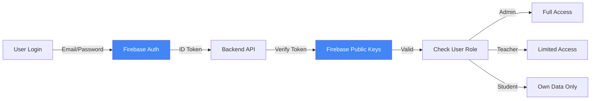
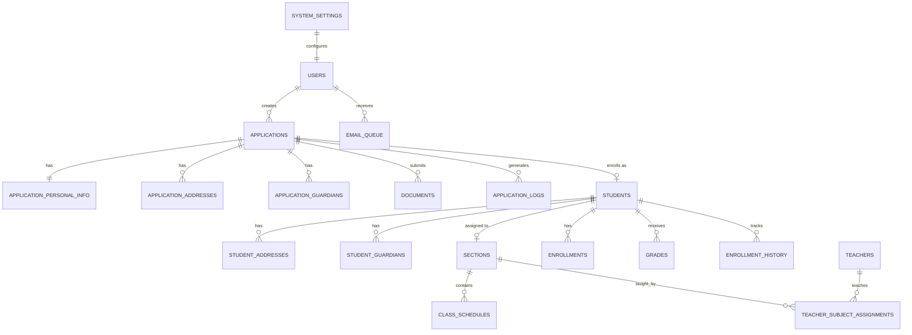

```mermaid
graph TB
    subgraph "Client Layer - Frontend"
        A1[Student Dashboard<br/>studentDashboard.html]
        A2[Admin Dashboard<br/>adminDashboard.html]
        A3[Teacher Dashboard<br/>teacherDashboard.html]
        A4[Application Form<br/>applicationForm.html]
        A5[Documents Manager<br/>documents.html]
        A6[Users Management<br/>users.html]
        A7[Sections Manager<br/>sections.html]
        A8[Login Page<br/>login.html]
    end

    subgraph "JavaScript Layer - Client-Side Logic"
        B1[Firebase Auth SDK<br/>firebaseConfig.js]
        B2[Role-Based Auth<br/>roleBasedAuth.js]
        B3[API Config<br/>apiConfig.js]
        B4[Applications Handler<br/>applications.js]
        B5[Documents Handler<br/>documents.js]
        B6[Users Handler<br/>users.js]
        B7[Access Control<br/>accessControl.js]
    end

    subgraph "External Services"
        EXT1[Firebase Authentication<br/>Google Cloud]
        EXT2[PSGC Location API<br/>psgc.gitlab.io]
        EXT3[SMTP Server<br/>Gmail SMTP]
        EXT4[reCAPTCHA<br/>Google]
    end

    subgraph "API Gateway Layer"
        C1[Authentication API<br/>api/login.php]
        C2[User Sync API<br/>api/sync_user.php]
        C3[Application APIs<br/>api/submit_application.php<br/>api/get_application.php<br/>api/get_all_applications.php]
        C4[Document APIs<br/>api/upload_document_enhanced.php<br/>api/verify_document.php<br/>api/download_document.php]
        C5[Student APIs<br/>api/students/create.php<br/>api/students/get_all.php<br/>api/students/move.php]
        C6[Section APIs<br/>api/sections/list.php<br/>api/sections/create.php]
        C7[Teacher APIs<br/>api/teachers/get_assignments.php]
        C8[Admin APIs<br/>api/admin_dashboard.php<br/>api/get_users.php<br/>api/update_user_role.php]
        C9[Settings APIs<br/>api/settings/public.php]
        C10[Email Queue API<br/>api/process_email_queue.php]
    end

    subgraph "Configuration Layer"
        D1[Database Config<br/>config/database.php]
        D2[Firebase Config<br/>config/firebase.php]
        D3[Email Config<br/>config/email.php]
        D4[Mailer Service<br/>config/Mailer.php]
    end

    subgraph "Business Logic Layer - PHP Classes"
        E1[Application Class<br/>classes/Application.php]
        E2[User Class<br/>classes/User.php]
        E3[Document Class<br/>classes/Document.php]
        E4[Logger Class<br/>classes/Logger.php]
    end

    subgraph "Data Access Layer"
        F1[(MySQL Database<br/>vpes_sims)]
    end

    subgraph "Database Tables - Core Entities"
        G1[users]
        G2[applications]
        G3[application_personal_info]
        G4[application_addresses]
        G5[application_guardians]
        G6[students]
        G7[student_addresses]
        G8[student_guardians]
        G9[sections]
        G10[teachers]
    end

    subgraph "Database Tables - Supporting Entities"
        H1[documents]
        H2[enrollments]
        H3[grades]
        H4[class_schedules]
        H5[teacher_subject_assignments]
        H6[application_logs]
        H7[enrollment_history]
        H8[email_queue]
        H9[system_settings]
    end

    subgraph "File Storage Layer"
        I1[Document Uploads<br/>uploads/documents/]
        I2[Cache Storage<br/>cache/psgc_decoded_locations.json<br/>cache/firebase_keys.json]
        I3[Logs<br/>logs/]
    end

    subgraph "Scheduled Tasks & Background Jobs"
        J1[Email Queue Processor<br/>process_queue_cron.php]
        J2[Automated Scheduler<br/>automated_schedule/]
        J3[Windows Task Scheduler<br/>run_queue_silent.vbs]
    end

    %% Client to JavaScript connections
    A1 -->|User Interaction| B1
    A2 -->|User Interaction| B2
    A3 -->|User Interaction| B3
    A4 -->|Form Submission| B4
    A5 -->|Document Upload| B5
    A6 -->|User Management| B6
    A7 -->|Section Assignment| B7
    A8 -->|Authentication| B1

    %% JavaScript to External Services
    B1 -->|OAuth 2.0 / JWT Token| EXT1
    B2 -->|ID Token Verification| EXT1

    %% JavaScript to API Gateway
    B1 -->|POST: Login Request<br/>Bearer Token| C1
    B2 -->|POST: Sync User Data<br/>Firebase UID| C2
    B4 -->|POST: Application Data<br/>JSON Payload| C3
    B4 -->|GET: Fetch Application<br/>Authorization Header| C3
    B5 -->|POST: Multipart Form Data<br/>File Upload| C4
    B5 -->|GET: Document List<br/>Query Params| C4
    B6 -->|GET: User List<br/>Filters & Pagination| C8
    B6 -->|PUT: Update Role<br/>User ID & Role| C8
    B3 -->|GET: API Endpoint<br/>Dynamic Base URL| C3

    %% API to Configuration
    C1 -->|Database Connection| D1
    C1 -->|Verify ID Token| D2
    C2 -->|Database Connection| D1
    C3 -->|Database Connection| D1
    C4 -->|Database Connection| D1
    C5 -->|Database Connection| D1
    C6 -->|Database Connection| D1
    C7 -->|Database Connection| D1
    C8 -->|Database Connection| D1
    C9 -->|Database Connection| D1
    C10 -->|SMTP Configuration| D3
    C10 -->|Send Email| D4

    %% API to Business Logic
    C1 -->|Authenticate User| E2
    C2 -->|Sync Firebase User| E2
    C3 -->|CRUD Operations| E1
    C4 -->|Upload/Verify Docs| E3
    C8 -->|User Operations| E2
    E1 -->|Log Actions| E4
    E3 -->|Log Actions| E4

    %% Business Logic to External APIs
    E1 -->|HTTP GET Request<br/>Location Code Lookup| EXT2
    D4 -->|SMTP TLS Port 587<br/>Email Delivery| EXT3
    C1 -->|POST: Token Validation<br/>Site Key| EXT4

    %% Configuration to Database
    D1 -->|PDO Connection<br/>MySQL Driver| F1

    %% Database to Tables
    F1 -.->|Schema Definition| G1
    F1 -.->|Schema Definition| G2
    F1 -.->|Schema Definition| G3
    F1 -.->|Schema Definition| G4
    F1 -.->|Schema Definition| G5
    F1 -.->|Schema Definition| G6
    F1 -.->|Schema Definition| G7
    F1 -.->|Schema Definition| G8
    F1 -.->|Schema Definition| G9
    F1 -.->|Schema Definition| G10

    F1 -.->|Schema Definition| H1
    F1 -.->|Schema Definition| H2
    F1 -.->|Schema Definition| H3
    F1 -.->|Schema Definition| H4
    F1 -.->|Schema Definition| H5
    F1 -.->|Schema Definition| H6
    F1 -.->|Schema Definition| H7
    F1 -.->|Schema Definition| H8
    F1 -.->|Schema Definition| H9

    %% Table Relationships
    G1 -->|Foreign Key<br/>user_id| G2
    G2 -->|Foreign Key<br/>application_id| G3
    G2 -->|Foreign Key<br/>application_id| G4
    G2 -->|Foreign Key<br/>application_id| G5
    G2 -->|Foreign Key<br/>application_id| H1
    G2 -->|Foreign Key<br/>application_id| H6
    G2 -->|Enrollment Process| G6
    G6 -->|Foreign Key<br/>student_id| G7
    G6 -->|Foreign Key<br/>student_id| G8
    G6 -->|Foreign Key<br/>section_id| G9
    G6 -->|Foreign Key<br/>student_id| H2
    G6 -->|Foreign Key<br/>student_id| H3
    G9 -->|Foreign Key<br/>section_id| H4
    G10 -->|Foreign Key<br/>teacher_id| H5
    G9 -->|Foreign Key<br/>section_id| H5
    G6 -->|Foreign Key<br/>student_id| H7
    G1 -->|Foreign Key<br/>user_id| H8

    %% Business Logic to File Storage
    E3 -->|Write Files<br/>File Path| I1
    E1 -->|Cache Location Data<br/>JSON Write| I2
    D2 -->|Cache Firebase Keys<br/>JSON Write| I2
    E4 -->|Write Logs<br/>Error/Info Logs| I3

    %% Scheduled Tasks
    J3 -->|Trigger Execution<br/>Windows Scheduler| J1
    J1 -->|Query Pending Emails<br/>SELECT Status=PENDING| H8
    J1 -->|Send Emails via SMTP<br/>Update Status| D4
    J2 -->|Auto-generate Schedules<br/>INSERT Schedules| H4

    %% Data Flow Labels
    style A1 fill:#e1f5ff
    style A2 fill:#e1f5ff
    style A3 fill:#e1f5ff
    style A4 fill:#e1f5ff
    style A5 fill:#e1f5ff
    style A6 fill:#e1f5ff
    style A7 fill:#e1f5ff
    style A8 fill:#e1f5ff
    
    style B1 fill:#fff3e0
    style B2 fill:#fff3e0
    style B3 fill:#fff3e0
    style B4 fill:#fff3e0
    style B5 fill:#fff3e0
    style B6 fill:#fff3e0
    style B7 fill:#fff3e0
    
    style C1 fill:#f3e5f5
    style C2 fill:#f3e5f5
    style C3 fill:#f3e5f5
    style C4 fill:#f3e5f5
    style C5 fill:#f3e5f5
    style C6 fill:#f3e5f5
    style C7 fill:#f3e5f5
    style C8 fill:#f3e5f5
    style C9 fill:#f3e5f5
    style C10 fill:#f3e5f5
    
    style D1 fill:#e8f5e9
    style D2 fill:#e8f5e9
    style D3 fill:#e8f5e9
    style D4 fill:#e8f5e9
    
    style E1 fill:#fff9c4
    style E2 fill:#fff9c4
    style E3 fill:#fff9c4
    style E4 fill:#fff9c4
    
    style F1 fill:#ffebee
    
    style EXT1 fill:#fce4ec
    style EXT2 fill:#fce4ec
    style EXT3 fill:#fce4ec
    style EXT4 fill:#fce4ec
```

# VPES-SIMS System Architecture Diagram

> **Detailed System Architecture for Vinzons Pilot Elementary School - Student Information Management System**
> 
> Generated: December 2, 2025

---

## 📐 Complete System Architecture



---

## 🔄 Data Flow Descriptions

### 1. **User Authentication Flow**
```
User → Login Page → Firebase Auth SDK → Firebase Cloud → ID Token → API Login → 
Firebase Config (Verify Token) → User Class → Database → Session Created
```

### 2. **Application Submission Flow**
```
Student → Application Form → Applications Handler → API Submit Application → 
Application Class → PSGC API (Location Decode) → Database Tables (applications, 
application_personal_info, application_addresses, application_guardians) → 
Application Logs → Response to Student
```

### 3. **Document Upload Flow**
```
User → Documents Page → Documents Handler → API Upload Document → 
Document Class → File Storage (uploads/documents/) → Database (documents table) → 
Logger → Success Response
```

### 4. **Email Notification Flow**
```
System Event → Email Queue Table → Windows Task Scheduler → Process Queue Cron → 
Email Queue API → Mailer Service → SMTP Server → Email Sent → 
Update Queue Status
```

### 5. **Section Assignment Flow**
```
Admin → Sections Manager → API Section List → Database (sections, students) → 
Display Sections → Admin Assigns Student → API Students Move → 
Update student.section_id → Enrollment History Log
```

### 6. **Grade Entry Flow**
```
Teacher → Teacher Dashboard → Teacher APIs → Get Assignments → Database → 
Display Students → Submit Grades → API Update Grades → Grades Table → 
Email Notification Queue
```

---

## 🏗️ Layer Descriptions

### **Client Layer (Frontend)**
- **Purpose**: User interface for different user roles
- **Technologies**: HTML5, CSS3, Bootstrap 5
- **Files**: `*.html` files in root directory
- **Access Control**: Role-based page access (Student, Admin, Teacher)

### **JavaScript Layer**
- **Purpose**: Client-side logic, API communication, authentication
- **Technologies**: ES6+ JavaScript, Firebase SDK, Fetch API
- **Files**: `JS/*.js`
- **Key Features**: Token management, API requests, dynamic UI updates

### **External Services Layer**
- **Firebase Authentication**: User authentication via Google OAuth 2.0
- **PSGC API**: Philippine Standard Geographic Code location lookup
- **Gmail SMTP**: Email delivery service (Port 587 TLS)
- **Google reCAPTCHA**: Bot protection on forms

### **API Gateway Layer**
- **Purpose**: RESTful API endpoints for all operations
- **Technologies**: PHP 7.4+, JSON responses
- **Files**: `api/**/*.php`
- **Security**: Bearer token authentication, CORS enabled

### **Configuration Layer**
- **Purpose**: System configuration and service initialization
- **Files**: `config/*.php`
- **Components**:
  - Database connection (PDO)
  - Firebase token verification (JWT)
  - Email SMTP settings
  - Mailer wrapper (PHPMailer)

### **Business Logic Layer**
- **Purpose**: Core application logic and business rules
- **Technologies**: Object-Oriented PHP
- **Files**: `classes/*.php`
- **Classes**:
  - `Application`: Handles enrollment applications, location decoding
  - `User`: Firebase user synchronization
  - `Document`: File upload and verification
  - `Logger`: Activity logging

### **Data Access Layer**
- **Purpose**: Database connection management
- **Technology**: PDO (PHP Data Objects)
- **Database**: MySQL 8.0+
- **Features**: Prepared statements, transaction support

### **Database Schema**
- **Core Tables**: 19 normalized tables
- **Key Entities**:
  - Users & Authentication
  - Applications (with normalized personal info, addresses, guardians)
  - Students (with addresses and guardians)
  - Sections & Enrollments
  - Teachers & Assignments
  - Documents & Grades
  - Logs & Settings

### **File Storage Layer**
- **Document Storage**: `uploads/documents/` (PDF, images)
- **Cache Storage**: JSON files for API responses
- **Logs**: Error and application logs

### **Background Jobs Layer**
- **Email Queue**: Asynchronous email sending
- **Automated Scheduler**: Class schedule generation
- **Cron Jobs**: Windows Task Scheduler integration

---

## 🔐 Security Architecture

### Authentication & Authorization


### Data Flow Security
- **Frontend → Backend**: HTTPS, Bearer Token in Authorization header
- **Backend → Database**: PDO prepared statements (SQL injection prevention)
- **Backend → External APIs**: HTTPS, timeout limits
- **File Uploads**: MIME type validation, file size limits
- **Token Caching**: Secure cache directory with 1-hour expiry

---

## 📊 Database Entity Relationship Overview



---

## 🔧 Technology Stack Summary

| Layer | Technology | Version |
|-------|-----------|---------|
| **Frontend** | HTML5, CSS3, Bootstrap | 5.3.0 |
| **Client Script** | JavaScript (ES6+) | - |
| **Backend** | PHP | 7.4+ |
| **Database** | MySQL | 8.0+ |
| **Web Server** | Apache (XAMPP) | 3.3.0 |
| **Authentication** | Firebase Auth | SDK 10.x |
| **Email** | PHPMailer, Gmail SMTP | - |
| **External API** | PSGC GitLab API | v1 |
| **Caching** | File-based JSON cache | - |
| **Task Scheduler** | Windows Task Scheduler | - |

---

## 📝 API Endpoints Summary

| Category | Endpoint | Method | Purpose |
|----------|----------|--------|---------|
| **Auth** | `/api/login.php` | POST | User authentication |
| **Auth** | `/api/sync_user.php` | POST | Sync Firebase user to DB |
| **Applications** | `/api/submit_application.php` | POST | Submit enrollment |
| **Applications** | `/api/get_application.php` | GET | Get user application |
| **Applications** | `/api/get_all_applications.php` | GET | List all (admin) |
| **Documents** | `/api/upload_document_enhanced.php` | POST | Upload document |
| **Documents** | `/api/verify_document.php` | PUT | Verify/reject document |
| **Students** | `/api/students/get_all.php` | GET | List students |
| **Students** | `/api/students/move.php` | POST | Move to section |
| **Sections** | `/api/sections/list.php` | GET | List sections |
| **Teachers** | `/api/teachers/get_assignments.php` | GET | Get teacher schedule |
| **Admin** | `/api/admin_dashboard.php` | GET | Dashboard stats |
| **Settings** | `/api/settings/public.php` | GET | Public settings |

---

## 🎯 Key System Features

### ✅ Implemented Features
1. **Multi-role Authentication** (Student, Teacher, Admin)
2. **Online Enrollment Application** with normalized data structure
3. **Document Upload & Verification** with cloud storage
4. **Section Management** with student assignment
5. **Grade Entry System** for teachers
6. **Email Notification Queue** with background processing
7. **Location Decoding** with PSGC API integration and caching
8. **User Management** with Firebase sync
9. **Dashboard Analytics** for admin
10. **Responsive UI** with Bootstrap 5

### 🔄 Data Processing Patterns
- **Caching Strategy**: File-based cache for API responses (1-hour TTL)
- **Transaction Management**: Database transactions for multi-table operations
- **Error Handling**: Try-catch blocks with error logging
- **Normalization**: Separated tables for addresses, guardians, personal info
- **Audit Trail**: Application logs and enrollment history

---

## 📈 System Scalability Considerations

### Current Architecture
- **Monolithic PHP application** with modular class structure
- **File-based caching** (sufficient for school-level deployment)
- **Single MySQL database** (local XAMPP server)

### Future Enhancement Paths
1. **Redis/Memcached** for distributed caching
2. **CDN integration** for document delivery
3. **Load balancer** for multi-server deployment
4. **Microservices** separation (Auth, Enrollment, Grading)
5. **Message queue** (RabbitMQ) for async tasks
6. **Docker containerization** for easy deployment

---

**System Version**: Production Ready  
**Last Updated**: December 2, 2025  
**Architecture Type**: Layered MVC with Service-Oriented Components  
**Deployment**: XAMPP (Local/School Server)
